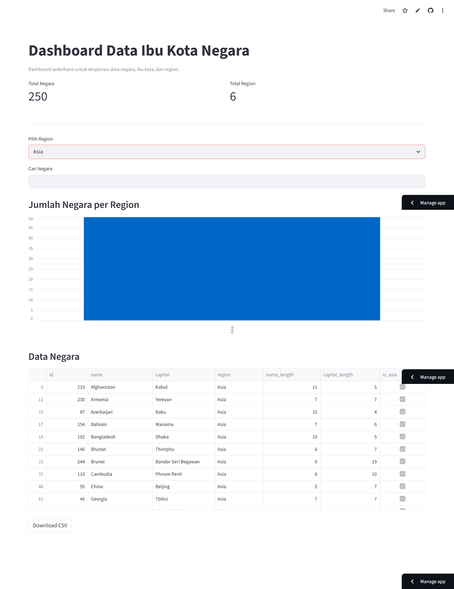

# Countries ETL Project
Mini end-to-end data engineering project using Python, REST API, PostgreSQL, and Streamlit Cloud.

## Description
This project is a mini ETL pipeline that extracts country and capital city data from the RestCountries API, transforms the data, and loads it into a Supabase PostgreSQL database. The processed data is then visualized through an interactive Streamlit dashboard.

---

## Impact
- Successfully built an end-to-end ETL pipeline
- Automated data ingestion from API to PostgreSQL
- Deployed a live interactive dashboard using Streamlit Cloud

---

## Skills
- Data Engineering (ETL)
- API Integration
- PostgreSQL
- Data Transformation (Pandas)
- Data Visualization (Streamlit)
- Deployment (Streamlit Cloud)

---

## Architecture Diagram
RestCountries API  
↓  
Python ETL (Extract → Transform → Load)  
↓  
Supabase PostgreSQL  
↓  
Streamlit Dashboard

---

## Technology
- Python
- requests
- pandas
- psycopg2
- python-dotenv
- Supabase PostgreSQL
- Streamlit
- Plotly

---

## Setup Project

### 1. Install dependencies
Run the following command:
```bash
pip install -r requirements.txt
```

### 2. Setup environment variables
Buat file .env di folder project:
```env
DB_HOST=your_host
DB_NAME=your_db
DB_USER=your_user
DB_PASSWORD=your_password
DB_PORT=5432
```

## Cara Menjalankan ETL
```bash
python etl_countries.py
```

## Cara Menjalankan Dashboard
```bash
streamlit run dashboard_countries.py
```
Lalu buka di browser:
```
http://localhost:8501
```

## Contoh Query SQL
```sql
SELECT 
    name,
    capital,
    region,
    name_length,
    capital_length,
    is_asia
FROM countries
LIMIT 10;
```

## Fitur
### ETL
- Extract data dari API
- Transform (data cleaning + enrichment)
- Load ke PostgreSQL
- Logging
- Error handling
- Idempotent pipeline (ON CONFLICT)

## Dashboard
- KPI (total negara, region)
- Filter region
- Search negara
- Visualisasi distribusi region

## Hasil
- Data bersih dan tidak duplikat
- Pipeline ETL modular
- Dashboard interaktif

## Live Demo
https://countries-etl-project-bzvcyx4t8apew83jcgjvnw.streamlit.app/

## Dashboard Preview

